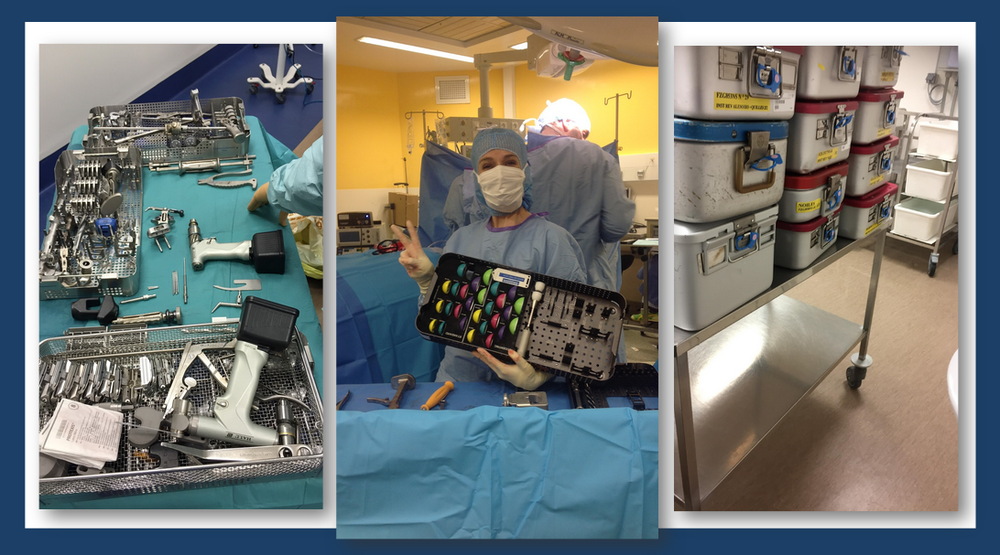
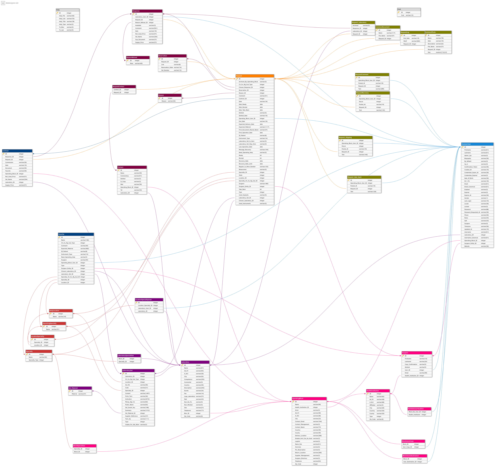

##### Side Project  

TODO : fill in worflow > get the data, the table dimension name
TODO : give a .png file of the only tables used in metabase dataset

  
 
 
 

# pelican_sideproject
The same data as the databird capstone project, is approached in a different way.It's about an ETL pipeline that extract Data from .csv, cleasning them with Python and use them with TableauSotware.

## About the project

A Health logistic startup, Arsenal, want to explore its data to grown and have an overview of its users. The data resides in Database, in 32 tables, and in sendInblue for the users logs. The purpose is extract the data, stage them, clean and transform for an analy to continue findings insights in what material the users need to.

## Context

>Arsenal Surgical is a digital platform that allows health care facilities to borrow medical equipment from their suppliers and return what has not been used. The tool allows the control of incoming and outgoing flows in order to optimize stocks and costs. 

For some surgical procedures, it is possible to rent equipment on loan to supplement the necessary equipment already available in the health facility (ES). This material, or medical device (DM), is composed of 2 parts:
* The instrument set used to place the implant. It is a toolbox that can be reused after a sterilization cycle.
* Implants, or implantable medical devices (IMD), remain in the patient and are not reusable. 
* Implant kits rented by healthcare facilities to pharmaceutical companies include all available sizes. The choice is made according to the patient's anatomy. Only installed implants are charged. 
*  The rest of the unused implants are returned to the laboratory with the instruments rented by the healthcare facility.

Arsenal Surgical streamlines the ordering system between the healthcare facility and the laboratory and makes the process more transparent. The company was founded in 2016 by Pierre Cosson. 

 
 
 
 

## Getting started

The first dataset is hosted on Metabase. It consists of 32 tables. They will be extracted, the database reconstructed and saved in csv files.
The second data set come from Sendinblue
[You can find here](dataDictionnary.ipynb) a data dictionnary about the whole data used. 

##### Metabase Dataset
The whole database with its 32 tables
 
 
 
 

Since the database schema is not accessible, the tables are first saved as .csv from Metabse then transformed into .sql and the database rebuilt with Postgressql following Metabase to find the foreign and primary keys.
Only a few tables will be used an d saved in .csv

Todod: add .png about the smallest database used.

##### Sendiblue
The second dataset consists of log file in .csv, generated by event based on the request in the dataset above. These give us app activity logs from the interaction of the users with ArsenalChirurgical. 

## Workflow

### tools
* python
* jupyter-notebook
* Tableau software
* converter_to_csv
* Metabase
* postgresql
* DbDesigner.net
* dbdiagram.io

### Get the data
* Explore data on Metabase
  * save the tables on .csv files
  * transform the .csv files in .sql files
  * with DbDesigner.net and Metabase, build the database schema
        * the fact table is `request`
        * the dimension table are `surgeon` ..

### Create clean files
* Drop duplicates
* Fill null values
* Take care of the names and the `int`
* Save in new files

### Play with Tableau Software
* drop name for demonstration in the data
* make workshette then dashboard
  
